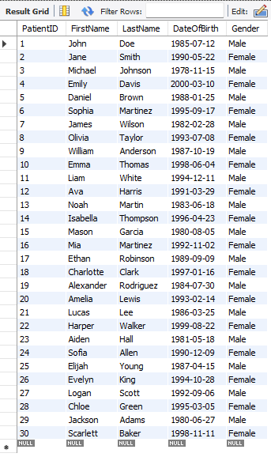

# Creating-a-Database-in-SQL

This project involves designing and implementing a structured database system for a hospital using SQL. The process includes manually creating multiple tables that define the core components of the hospital’s operations. After defining the tables, the data will be loaded using SQL's _`INSERT`_ statement to populate the tables with relevant information, forming a cohesive and functional hospital database. This setup will enable efficient management and retrieval of hospital data, ensuring smooth operational workflows.

## Procedures
- Creating the Database
Begin by creating the database that will serve as the central repository for all hospital-related data. This database will store the tables required to manage various aspects of the hospital operations.
```
CREATE DATABASE HospitalDB;
```
- Creating Tables and Columns
Once the database is created, define the structure of the tables, which represent different entities such as patients, doctors, appointments, etc. Each table will have specific columns that store individual attributes of those entities (e.g., patient name, doctor specialty)

_First I will be creating the Patient Table_

```
CREATE TABLE Patients (
    PatientID INT PRIMARY KEY,
    FirstName VARCHAR(50),
    LastName VARCHAR(50),
    DateOfBirth DATE,
    Gender VARCHAR(10)
);
```
---
_Now I insert the Values_

```
INSERT INTO Patients (PatientID, FirstName, LastName, DateOfBirth, Gender) 
VALUES 
(1, 'John', 'Doe', '1985-07-12', 'Male'),
(2, 'Jane', 'Smith', '1990-05-22', 'Female'),
(3, 'Michael', 'Johnson', '1978-11-15', 'Male'),
(4, 'Emily', 'Davis', '2000-03-10', 'Female'),
(5, 'Daniel', 'Brown', '1988-01-25', 'Male'),
(6, 'Sophia', 'Martinez', '1995-09-17', 'Female'),
(7, 'James', 'Wilson', '1982-02-28', 'Male'),
(8, 'Olivia', 'Taylor', '1993-07-08', 'Female'),
(9, 'William', 'Anderson', '1987-10-19', 'Male'),
(10, 'Emma', 'Thomas', '1998-06-04', 'Female'),
(11, 'Liam', 'White', '1994-12-11', 'Male'),
(12, 'Ava', 'Harris', '1991-03-29', 'Female'),
(13, 'Noah', 'Martin', '1983-06-18', 'Male'),
(14, 'Isabella', 'Thompson', '1996-04-23', 'Female'),
(15, 'Mason', 'Garcia', '1980-08-05', 'Male'),
(16, 'Mia', 'Martinez', '1992-11-02', 'Female'),
(17, 'Ethan', 'Robinson', '1989-09-09', 'Male'),
(18, 'Charlotte', 'Clark', '1997-01-16', 'Female'),
(19, 'Alexander', 'Rodriguez', '1984-07-30', 'Male'),
(20, 'Amelia', 'Lewis', '1993-02-14', 'Female'),
(21, 'Lucas', 'Lee', '1986-03-25', 'Male'),
(22, 'Harper', 'Walker', '1999-08-22', 'Female'),
(23, 'Aiden', 'Hall', '1981-05-18', 'Male'),
(24, 'Sofia', 'Allen', '1990-12-09', 'Female'),
(25, 'Elijah', 'Young', '1987-04-15', 'Male'),
(26, 'Evelyn', 'King', '1994-10-28', 'Female'),
(27, 'Logan', 'Scott', '1992-09-06', 'Male'),
(28, 'Chloe', 'Green', '1995-03-05', 'Female'),
(29, 'Jackson', 'Adams', '1980-06-27', 'Male'),
(30, 'Scarlett', 'Baker', '1998-11-11', 'Female');

```
---

_Results_




_Department_
```
CREATE TABLE Department (
    Department_ID INT PRIMARY KEY,           -- Unique ID for each department
    Department_Name VARCHAR(100) NOT NULL,   -- Name of the hospital department (e.g., Cardiology, Surgery)
    Department_Head VARCHAR(100),            -- Head of the department
    Phone_Number VARCHAR(15),                -- Contact number for the department
    Location VARCHAR(100),                   -- Physical location within the hospital (e.g., Building A, Floor 3)
    Number_of_Staff INT                     -- Number of staff members in the department
);

```


_Doctors Table_

```
CREATE TABLE Doctor (
    Doctor_ID INT PRIMARY KEY,          -- Unique ID for each doctor
    First_Name VARCHAR(50) NOT NULL,    -- Doctor's first name
    Last_Name VARCHAR(50) NOT NULL,     -- Doctor's last name
    Gender VARCHAR(10),                 -- Doctor's gender (Male/Female/Other)
    Specialty VARCHAR(100) NOT NULL,    -- Doctor's area of specialization (e.g., Cardiologist, Surgeon)
    Phone_Number VARCHAR(15),           -- Contact number
    Email VARCHAR(100),                 -- Doctor's email address
    Hire_Date DATE NOT NULL,            -- Date when the doctor was hired
    Salary DECIMAL(10, 2),              -- Doctor's salary
    Department_ID INT,                  -- Foreign key to the Department table 
    Date_Of_Birth DATE,                 -- Doctor's date of birth
    Address VARCHAR(255),               -- Doctor's home address
    Shift_Time VARCHAR(50),             -- Doctor's shift schedule (e.g., "Morning", "Night")
    Employment_Status VARCHAR(50),      -- Whether the doctor is Full-time, Part-time, or Consultant
    FOREIGN KEY (Department_ID) REFERENCES Department(Department_ID)  -- Reference to Department table
);
```

_Medical Records Table_
```
CREATE TABLE Medical_Record (
    Record_ID INT PRIMARY KEY AUTO_INCREMENT,
    Patient_ID INT NOT NULL,
    Doctor_ID INT NOT NULL,
    Diagnosis VARCHAR(255) NOT NULL,
    Treatment_Plan TEXT,
    Prescription TEXT,
    Visit_Date DATE NOT NULL,
    Follow_Up DATE,
    FOREIGN KEY (Patient_ID) REFERENCES Patient(Patient_ID),
    FOREIGN KEY (Doctor_ID) REFERENCES Doctor(Doctor_ID)
);
```


