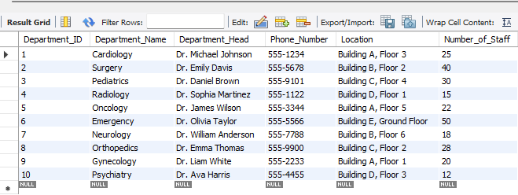
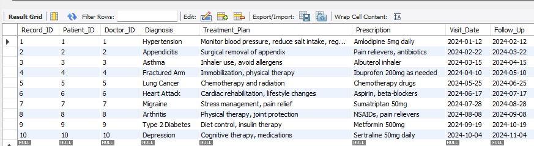

# Creating-a-Database-in-SQL

This project involves designing and implementing a structured database system for a hospital using SQL. The process includes manually creating multiple tables that define the core components of the hospital’s operations. After defining the tables, the data will be loaded using SQL's _`INSERT`_ statement to populate the tables with relevant information, forming a cohesive and functional hospital database. This setup will enable efficient management and retrieval of hospital data, ensuring smooth operational workflows.

## Procedures
- Creating the Database
Begin by creating the database that will serve as the central repository for all hospital-related data. This database will store the tables required to manage various aspects of the hospital operations.
```
CREATE DATABASE HospitalDB;
```
- Creating Tables and Columns
Once the database is created, define the structure of the tables, which represent different entities such as patients, doctors, appointments, etc. Each table will have specific columns that store individual attributes of those entities (e.g., patient name, doctor specialty)

_First I will be creating the Patient Table_

```
CREATE TABLE Patients (
    PatientID INT PRIMARY KEY,
    FirstName VARCHAR(50),
    LastName VARCHAR(50),
    DateOfBirth DATE,
    Gender VARCHAR(10)
);
```
---
_Now I insert the Values_

```
INSERT INTO Patients (PatientID, FirstName, LastName, DateOfBirth, Gender) 
VALUES 
(1, 'John', 'Doe', '1985-07-12', 'Male'),
(2, 'Jane', 'Smith', '1990-05-22', 'Female'),
(3, 'Michael', 'Johnson', '1978-11-15', 'Male'),
(4, 'Emily', 'Davis', '2000-03-10', 'Female'),
(5, 'Daniel', 'Brown', '1988-01-25', 'Male'),
(6, 'Sophia', 'Martinez', '1995-09-17', 'Female'),
(7, 'James', 'Wilson', '1982-02-28', 'Male'),
(8, 'Olivia', 'Taylor', '1993-07-08', 'Female'),
(9, 'William', 'Anderson', '1987-10-19', 'Male'),
(10, 'Emma', 'Thomas', '1998-06-04', 'Female'),
(11, 'Liam', 'White', '1994-12-11', 'Male'),
(12, 'Ava', 'Harris', '1991-03-29', 'Female'),
(13, 'Noah', 'Martin', '1983-06-18', 'Male'),
(14, 'Isabella', 'Thompson', '1996-04-23', 'Female'),
(15, 'Mason', 'Garcia', '1980-08-05', 'Male'),
(16, 'Mia', 'Martinez', '1992-11-02', 'Female'),
(17, 'Ethan', 'Robinson', '1989-09-09', 'Male'),
(18, 'Charlotte', 'Clark', '1997-01-16', 'Female'),
(19, 'Alexander', 'Rodriguez', '1984-07-30', 'Male'),
(20, 'Amelia', 'Lewis', '1993-02-14', 'Female'),
(21, 'Lucas', 'Lee', '1986-03-25', 'Male'),
(22, 'Harper', 'Walker', '1999-08-22', 'Female'),
(23, 'Aiden', 'Hall', '1981-05-18', 'Male'),
(24, 'Sofia', 'Allen', '1990-12-09', 'Female'),
(25, 'Elijah', 'Young', '1987-04-15', 'Male'),
(26, 'Evelyn', 'King', '1994-10-28', 'Female'),
(27, 'Logan', 'Scott', '1992-09-06', 'Male'),
(28, 'Chloe', 'Green', '1995-03-05', 'Female'),
(29, 'Jackson', 'Adams', '1980-06-27', 'Male'),
(30, 'Scarlett', 'Baker', '1998-11-11', 'Female');

```
---

**_Results**
---

---


_Department_
```
CREATE TABLE Department (
    Department_ID INT PRIMARY KEY,           -- Unique ID for each department
    Department_Name VARCHAR(100) NOT NULL,   -- Name of the hospital department (e.g., Cardiology, Surgery)
    Department_Head VARCHAR(100),            -- Head of the department
    Phone_Number VARCHAR(15),                -- Contact number for the department
    Location VARCHAR(100),                   -- Physical location within the hospital (e.g., Building A, Floor 3)
    Number_of_Staff INT                     -- Number of staff members in the department
);

```
---
_Values for Department table_

```
INSERT INTO Department (Department_ID, Department_Name, Department_Head, Phone_Number, Location, Number_of_Staff) 
VALUES 
(1, 'Cardiology', 'Dr. Michael Johnson', '555-1234', 'Building A, Floor 3', 25),
(2, 'Surgery', 'Dr. Emily Davis', '555-5678', 'Building B, Floor 2', 40),
(3, 'Pediatrics', 'Dr. Daniel Brown', '555-9101', 'Building C, Floor 4', 30),
(4, 'Radiology', 'Dr. Sophia Martinez', '555-1122', 'Building D, Floor 1', 15),
(5, 'Oncology', 'Dr. James Wilson', '555-3344', 'Building A, Floor 5', 22),
(6, 'Emergency', 'Dr. Olivia Taylor', '555-5566', 'Building E, Ground Floor', 50),
(7, 'Neurology', 'Dr. William Anderson', '555-7788', 'Building B, Floor 6', 18),
(8, 'Orthopedics', 'Dr. Emma Thomas', '555-9900', 'Building C, Floor 2', 28),
(9, 'Gynecology', 'Dr. Liam White', '555-2233', 'Building A, Floor 1', 20),
(10, 'Psychiatry', 'Dr. Ava Harris', '555-4455', 'Building D, Floor 3', 12);
```
---
**_Result_**
---

---


_Doctors Table_

```
CREATE TABLE Doctor (
    Doctor_ID INT PRIMARY KEY,          -- Unique ID for each doctor
    First_Name VARCHAR(50) NOT NULL,    -- Doctor's first name
    Last_Name VARCHAR(50) NOT NULL,     -- Doctor's last name
    Gender VARCHAR(10),                 -- Doctor's gender (Male/Female/Other)
    Specialty VARCHAR(100) NOT NULL,    -- Doctor's area of specialization (e.g., Cardiologist, Surgeon)
    Phone_Number VARCHAR(15),           -- Contact number
    Email VARCHAR(100),                 -- Doctor's email address
    Hire_Date DATE NOT NULL,            -- Date when the doctor was hired
    Salary DECIMAL(10, 2),              -- Doctor's salary
    Department_ID INT,                  -- Foreign key to the Department table 
    Date_Of_Birth DATE,                 -- Doctor's date of birth
    Address VARCHAR(255),               -- Doctor's home address
    Shift_Time VARCHAR(50),             -- Doctor's shift schedule (e.g., "Morning", "Night")
    Employment_Status VARCHAR(50),      -- Whether the doctor is Full-time, Part-time, or Consultant
    FOREIGN KEY (Department_ID) REFERENCES Department(Department_ID)  -- Reference to Department table
);
```
_Values_

```
INSERT INTO Doctor (Doctor_ID, First_Name, Last_Name, Gender, Specialty, Phone_Number, Email, Hire_Date, Salary, Department_ID, Date_Of_Birth, Address, Shift_Time, Employment_Status)
VALUES 
(1, 'John', 'Doe', 'Male', 'Cardiologist', '555-1234', 'johndoe@hospital.com', '2015-06-10', 120000.00, 1, '1978-04-12', '123 Oak St, Cityville', 'Morning', 'Full-time'),
(2, 'Sarah', 'Williams', 'Female', 'Surgeon', '555-5678', 'sarahw@hospital.com', '2017-03-22', 150000.00, 2, '1983-08-30', '456 Maple Ave, Townsville', 'Night', 'Full-time'),
(3, 'James', 'Smith', 'Male', 'Pediatrician', '555-9101', 'jamessmith@hospital.com', '2020-01-15', 95000.00, 3, '1985-10-05', '789 Pine Rd, Cityville', 'Morning', 'Part-time'),
(4, 'Emily', 'Johnson', 'Female', 'Radiologist', '555-1122', 'emilyj@hospital.com', '2018-11-03', 110000.00, 4, '1990-12-11', '101 Elm St, Villagetown', 'Night', 'Full-time'),
(5, 'Michael', 'Brown', 'Male', 'Oncologist', '555-3344', 'michaelb@hospital.com', '2019-09-25', 140000.00, 5, '1975-03-17', '234 Cedar Ave, Townsville', 'Morning', 'Consultant'),
(6, 'Sophia', 'Martinez', 'Female', 'Emergency Physician', '555-5566', 'sophiam@hospital.com', '2016-07-07', 130000.00, 6, '1988-05-22', '345 Birch St, Cityville', 'Night', 'Full-time'),
(7, 'David', 'Wilson', 'Male', 'Neurologist', '555-7788', 'davidw@hospital.com', '2014-04-19', 145000.00, 7, '1979-06-14', '567 Poplar Rd, Villagetown', 'Morning', 'Full-time'),
(8, 'Olivia', 'Taylor', 'Female', 'Orthopedic Surgeon', '555-9900', 'oliviat@hospital.com', '2021-02-01', 135000.00, 8, '1987-09-09', '678 Chestnut Ave, Cityville', 'Night', 'Part-time'),
(9, 'William', 'Anderson', 'Male', 'Gynecologist', '555-2233', 'williamand@hospital.com', '2016-05-12', 125000.00, 9, '1982-11-30', '789 Palm St, Villagetown', 'Morning', 'Full-time'),
(10, 'Ava', 'Harris', 'Female', 'Psychiatrist', '555-4455', 'avah@hospital.com', '2018-10-18', 105000.00, 10, '1992-02-27', '910 Spruce Rd, Cityville', 'Night', 'Consultant');
```
---
**_Result_**
---

---


_Medical Records Table_
```
CREATE TABLE Medical_Record (
    Record_ID INT PRIMARY KEY AUTO_INCREMENT,
    Patient_ID INT NOT NULL,
    Doctor_ID INT NOT NULL,
    Diagnosis VARCHAR(255) NOT NULL,
    Treatment_Plan TEXT,
    Prescription TEXT,
    Visit_Date DATE NOT NULL,
    Follow_Up DATE,
    FOREIGN KEY (Patient_ID) REFERENCES Patient(Patient_ID),
    FOREIGN KEY (Doctor_ID) REFERENCES Doctor(Doctor_ID)
);
```
---

_Values_

```
INSERT INTO Medical_Record (Record_ID, Patient_ID, Doctor_ID, Diagnosis, Treatment_Plan, Prescription, Visit_Date, Follow_Up)
VALUES 
(1, 1, 1, 'Hypertension', 'Monitor blood pressure, reduce salt intake, regular exercise', 'Amlodipine 5mg daily', '2024-01-12', '2024-02-12'),
(2, 2, 2, 'Appendicitis', 'Surgical removal of appendix', 'Pain relievers, antibiotics', '2024-02-22', '2024-03-22'),
(3, 3, 3, 'Asthma', 'Inhaler use, avoid allergens', 'Albuterol inhaler', '2024-03-15', '2024-04-15'),
(4, 4, 4, 'Fractured Arm', 'Immobilization, physical therapy', 'Ibuprofen 200mg as needed', '2024-04-10', '2024-05-10'),
(5, 5, 5, 'Lung Cancer', 'Chemotherapy and radiation', 'Chemotherapy drugs', '2024-05-25', '2024-06-25'),
(6, 6, 6, 'Heart Attack', 'Cardiac rehabilitation, lifestyle changes', 'Aspirin, beta-blockers', '2024-06-17', '2024-07-17'),
(7, 7, 7, 'Migraine', 'Stress management, pain relief', 'Sumatriptan 50mg', '2024-07-28', '2024-08-28'),
(8, 8, 8, 'Arthritis', 'Physical therapy, joint protection', 'NSAIDs, pain relievers', '2024-08-08', '2024-09-08'),
(9, 9, 9, 'Type 2 Diabetes', 'Diet control, insulin therapy', 'Metformin 500mg', '2024-09-19', '2024-10-19'),
(10, 10, 10, 'Depression', 'Cognitive therapy, medications', 'Sertraline 50mg daily', '2024-10-04', '2024-11-04');
```
---

**_Result_**
---

---

## Conclusion

SQL is an exceptionally powerful tool for building and managing relational databases, particularly when handling large datasets consisting of millions of rows. Its structured nature allows for efficient data storage, retrieval, and manipulation, enabling organizations to store vast amounts of data in a scalable and secure manner. With SQL, complex queries can be executed to filter, sort, and aggregate data, ensuring quick access to valuable insights from massive datasets. Additionally, SQL supports robust data integrity, seamless relationships between tables, and optimized performance, making it a critical solution for managing large-scale data environments across industries.


